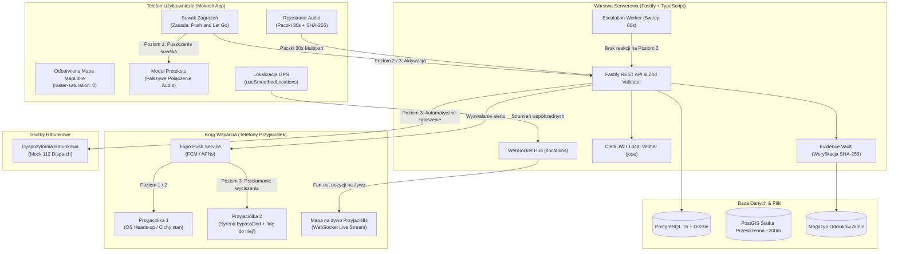

# Mokosh

> **Dyskretny system bezpieczeństwa osobistego oparty na kamuflażu, psychologicznej deeskalacji i nienaruszalnym łańcuchu dowodowym.**  
> Projekt zrealizowany na hackathon **HackYeah 2026**.

[](https://hackyeah.pl)
[](https://github.com/sioodmy/hackyeah2026/releases)
[](#stack-technologiczny-i-uzasadnienie-wyborów)
[](#devops-infrastruktura-i-środowisko-wytwórcze)

---

## Spis treści

1. [Zamysł i Koncepcja Produktowa](#zamysł-i-koncepcja-produktowa)
   - [Diagnoza problemu: Rzeczywistość nocnych ulic](#diagnoza-problemu-rzeczywistość-nocnych-ulic)
   - [Paradoks tradycyjnych aplikacji „Panic Button” / SOS](#paradoks-tradycyjnych-aplikacji-panic-button--sos)
   - [Filar I: Kamuflaż i Niewidzialność z dystansu („Stealth-First”)](#filar-i-kamuflaż-i-niewidzialność-z-dystansu-stealth-first)
   - [Filar II: Psychologiczny pretekst zamiast konfrontacji](#filar-ii-psychologiczny-pretekst-zamiast-konfrontacji)
   - [Filar III: Matryca Zagrożeń i mechanika „Push and Let Go”](#filar-iii-matryca-zagrożeń-i-mechanika-push-and-let-go)
   - [Filar IV: Błyskawiczny „Krąg Sióstr” (QR Sisterhood)](#filar-iv-błyskawiczny-krąg-sióstr-qr-sisterhood)
   - [Filar V: Łańcuch dowodowy audio (Chain of Custody)](#filar-v-łańcuch-dowodowy-audio-chain-of-custody)
   - [Filar VI: Miejska Heatmapa Bezpieczeństwa & Privacy by Design](#filar-vi-miejska-heatmapa-bezpieczeństwa--privacy-by-design)
2. [Stack Technologiczny i Uzasadnienie Wyborów](#stack-technologiczny-i-uzasadnienie-wyborów)
   - [Klient Mobilny (Mobile Application)](#1-klient-mobilny-mobile-application)
   - [Warstwa Backendowa i Architektura Czasu Rzeczywistego](#2-warstwa-backendowa-i-architektura-czasu-rzeczywistego)
   - [Baza Danych i Warstwa Przestrzenna](#3-baza-danych-i-warstwa-przestrzenna)
   - [DevOps, Infrastruktura i Środowisko Wytwórcze](#4-devops-infrastruktura-i-środowisko-wytwórcze)
3. [Architektura Systemu](#architektura-systemu)
4. [Świadome Kompromisy Inżynieryjne i Granice Modelu Zagrożeń](#świadome-kompromisy-inżynieryjne-i-granice-modelu-zagrożeń)
5. [Struktura Repozytorium](#struktura-repozytorium)
6. [Szybki Start (Getting Started)](#szybki-start-getting-started)
   - [Wymagania wstępne](#wymagania-wstępne)
   - [Konfiguracja środowiska](#konfiguracja-środowiska)
   - [Uruchomienie poszczególnych komponentów](#uruchomienie-poszczególnych-komponentów)
   - [Scenariusz testowy: Pełny przepływ alertu na dwóch urządzeniach](#scenariusz-testowy-pełny-przepływ-alertu-na-dwóch-urządzeniach)

---

## Zamysł i Koncepcja Produktowa

### Diagnoza problemu: Rzeczywistość nocnych ulic

Poczucie zagrożenia w przestrzeni miejskiej po zmroku nie jest jednostkowym, odosobnionym incydentem – to systemowe doświadczenie milionów kobiet w Polsce i całej Europie.

Według przekrojowych badań **Agencji Praw Podstawowych Unii Europejskiej (FRA)**:
* **Co trzecia kobieta (33%) w UE** doświadczyła przemocy fizycznej lub seksualnej po ukończeniu 15. roku życia.
* **1 na 20 kobiet (5%)** została zgwałcona.
* **Co druga kobieta (50%)** zetknęła się z przynajmniej jedną formą molestowania seksualnego (od natarczywego stalkingu i zaczepek słownych po obmacywanie w miejscach publicznych).

Dominująca od lat narracja prewencyjna opiera się na przerzucaniu odpowiedzialności na ofiarę: *„nie wracaj sama nocą”*, *„uważaj jak się ubierasz”*, *„unikaj ciemnych uliczek”*. To podejście moralizatorskie, stygmatyzujące i nieskuteczne.

**Mokosh** powstał w oparciu o fundamentalną zasadę:  
> **Każda z nas zasługuje na bezpieczeństwo. Nocne ulice bez strachu i bez pouczania.**  
> Zamiast moralizować i ograniczać swobodę kobiet, dostarczamy bezkompromisowe technologicznie narzędzie, które daje realną kontrolę, dyskrecję i sprawczość w krytycznych momentach.

---

### Paradoks tradycyjnych aplikacji „Panic Button” / SOS

Rynek aplikacji bezpieczeństwa pełen jest rozwiązań z wielkim czerwonym przyciskiem „SOS”. W realnych warunkach ulicznych te aplikacje okazują się bezużyteczne, a nierzadko wręcz niebezpieczne:

1. **Prowokacja agresora (Brak dyskrecji):**  
   Wyciągnięcie telefonu, odblokowanie ekranu i naciśnięcie świecącego na czerwono przycisku natychmiast zdradza zamiary ofiary. W konfrontacji z napastnikiem lub natrętem wywołuje to gwałtowną reakcję: natychmiastowy atak, wyrwanie telefonu z ręki i pozbawienie ofiary jakiegokolwiek kontaktu ze światem.
2. **Paraliż motoryki małej w stresie:**  
   Wyrzut adrenaliny i panika drastycznie upośledzają koordynację ruchową. Trafienie w drobne przyciski menu, wpisywanie kodu PIN czy wybieranie numeru z listy kontaktów staje się niewykonalne.
3. **Brak stopniowania (Zero-jedynkowość):**  
   Większość groźnych sytuacji nie zaczyna się od napaści fizycznej. Zaczyna się od nieprzyjemnej rozmowy na przystanku, toksycznej randki, pijanego natręta czy uczucia, że ktoś idzie za nami krok w krok. W takiej chwili nikt nie zadzwoni pod 112, ani nie odpali syreny alarmowej. Tradycyjne aplikacje nie oferują żadnego stadium pośredniego pomiędzy „jest super” a „stan zagrożenia życia”.

Mokosh całkowicie odrzuca ten paradygmat. Zastępujemy go **architekturą kamuflażu, stopniowalną matrycą zagrożeń oraz psychologiczną deeskalacją**.

---

### Filar I: Kamuflaż i Niewidzialność z dystansu („Stealth-First”)

Aplikacja Mokosh na pierwszy, drugi i trzeci rzut oka **wygląda jak zwykła, neutralna mapa nawigacyjna**.

* **Odbarwiony raster mapy:** Kafelki OpenStreetMap oraz CARTO Dark poddawane są bezpośredniej desaturacji na poziomie GPU (`raster-saturation: 0`, przyciemnienie `raster-brightness-max`). Ekran jest monochromatyczny, dyskretny i nie przyciąga wzroku osób postronnych z odległości metra.
* **Brak stygmatyzujących oznaczeń:** Na ekranie nie pojawia się ani jedno słowo w stylu `SOS`, `ALARM`, `POMOC` czy `REC`.
* **Subtelny wskaźnik stanu:** Jedynym potwierdzeniem dla użytkowniczki, że system czuwa lub rejestruje dźwięk, jest 6-pikselowy punkt o znikomym kryciu w rogu ekranu.

Nawet jeśli osoba idąca obok spojrzy w Twój ekran, zobaczy jedynie kogoś sprawdzającego trasę do domu.

---

### Filar II: Psychologiczny pretekst zamiast konfrontacji

Najskuteczniejszą obroną przed narastającym zagrożeniem jest **bezinwazyjna deeskalacja i ucieczka zanim dojdzie do kontaktu fizycznego**.

Dyskusja z napastnikiem lub agresorem w ciemnej ulicy zaostrza konflikt. W Poziomie 1 Mokosh aktywuje funkcję **fałszywego połączenia przychodzącego**:
* Po 10 sekundach od zatwierdzenia suwaka telefon generuje realistyczne połączenie pełnoekranowe (np. od „Mamy” lub wybranego kontaktu), z cichym dzwonkiem i realistyczną wibracją haptyczną.
* Po odebraniu z głośnika odtwarzana jest ambientowa, autentycznie brzmiąca rozmowa tła (trwająca ok. 30 s).
* **Efekt psychologiczny:** Użytkowniczka zyskuje żelazne alibi do natychmiastowego przerwania rozmowy (*„Przepraszam, mama do mnie dzwoni, już na mnie czekają za rogiem”*). Agresor otrzymuje jasny sygnał: *ktoś wie, gdzie ona jest, ktoś na nią czeka i zaraz tu będzie*.
* **Sprytny zbieg ergonomiczny:** Przyłożenie telefonu do ucha w 100% naturalnie maskuje systemowy, zielony wskaźnik użycia mikrofonu (wymóg systemowy w nowszych wersjach Androida i iOS). Użytkowniczka nie musi niczego ukrywać – telefon przy uchu to najbardziej naturalny widok na świecie.

---

### Filar III: Matryca Zagrożeń i mechanika „Push and Let Go”

Suwak zagrożenia w Mokosh eliminuje ryzyko pomyłki i uwzględnia fizjologię stresu dzięki zasadzie **Push and Let Go**:
* Dopóki palec dotyka ekranu, **żaden alert nie zostaje wysłany**. Możesz wahać się, przesuwać wskaźnik w tę i z powrotem.
* Dopiero **oderwanie kciuka** zatwierdza wybrany poziom.
* Przypadkowe otarcie telefonu w kieszeni, torebce czy potknięcie się **nie wywoła fałszywego alarmu**.
* Przeciągnięcie suwaka z powrotem do zera natychmiast wygasza wszystkie działania i odwołuje alert u znajomych.

```
       0                    1                     2                     3
  [ Spoczynek ] ----> [  Pretekst  ] ----> [ Krąg Sióstr ] ----> [ Pełny Alarm ]
    (Neutralny)       (Fake call 10s)     (Live GPS + Call)     (Syrena + 112 + Chmura)
```

| Strefa | Kolor | Co dzieje się na Twoim telefonie | Co dzieje się w Kręgu Zaufanych Przyjaciółek |
| :--- | :--- | :--- | :--- |
| **0: Spoczynek** | Szary | Odbarwiona, cicha mapa uliczna. Stan neutralny, do którego aplikacja powraca po każdym odwołaniu alertu. | Cisza. Brak powiadomień w tle, zerowy drenaż baterii. |
| **1: Pretekst** | Żółty | Po 10 s telefon symuluje połączenie przychodzące od bliskiego kontaktu z ambientową rozmową w tle. Użytkowniczka zyskuje powód do odejścia. | Ciche powiadomienie systemowe (OS-level heads-up), informujące, że uruchomiłaś pretekst wyjścia. Nie blokuje ich ekranu. |
| **2: Krąg Sióstr** | Pomarańczowy | Wszystko z poziomu 1 + natychmiastowe uruchomienie transmisji współrzędnych GPS na żywo przez kanał WebSocket. | Pełnoekranowe wywołanie z przyciskiem **Odbierz**. Po odebraniu nawiązywane jest połączenie głosowe, na Twoim telefonie pojawia się status *„Kasia rozmawia”*, a przyjaciółka widzi Twój poruszający się punkt na mapie. |
| **3: Pełny Alarm** | Czerwony | Niewidoczna rejestracja audio w 30-sekundowych paczkach SHA-256 z natychmiastowym uploadem do chmury. Równolegle wyzwalane jest automatyczne zgłoszenie do dyspozytorni ratunkowej (mock 112). | **Krytyczna syrena alarmowa** przełamująca tryb wyciszenia telefonu (`bypassDnd`). Syrena milknie wyłącznie wtedy, gdy przyjaciółka wciśnie przycisk **„Idę do niej”**, co natychmiast wyświetla się u Ciebie jako potwierdzenie pomocy. |

Podbicie suwaka w trakcie trwania alertu natychmiast eskaluje powiadomienia u znajomych (np. przyjaciółka, która widziała powiadomienie poziomu 1, usłyszy głośną syrenę poziomu 3).

---

### Filar IV: Błyskawiczny „Krąg Sióstr” (QR Sisterhood)

Budowanie sieci zaufania nie może wymagać uciążliwego wymieniania się numerami telefonów, wyszukiwania profili w mediach społecznościowych ani tworzenia skomplikowanych kont.

* **Parowanie w 3 sekundy:** Wychodzicie razem z klubu, imprezy, biblioteki czy uczelni? Jedna osoba generuje w aplikacji jednorazowy kod QR, druga skanuje go aparatem.
* **Czasowe zaufanie:** Krąg czuwania zostaje zestawiony na czas nocnego powrotu.
* **Pełna asymetria i prywatność:** Zaproszenie jest kryptograficznie podpisanym tokenem HMAC z ograniczonym czasem życia. Uniemożliwia to podsłuchanie relacji lub wielokrotne wykorzystanie kodu ze zrzutu ekranu.

---

### Filar V: Łańcuch dowodowy audio (Chain of Custody)

W sytuacjach napaści sprawca niemal natychmiast próbuje odebrać telefon ofierze, rozbić go lub wrzucić do rzeki, licząc na zasadę „słowo przeciwko słowu”.

Mokosh rozwiązuje ten problem architekturą **natychmiastowej dyspersji dowodowej**:
1. Po wejściu w Poziom 3 rejestrator dzieli strumień audio na **30-sekundowe segmenty**.
2. W chwili zamknięcia segmentu telefon natychmiast przesyła go na serwer przez szyfrowane połączenie HTTPS.
3. Backend natychmiast weryfikuje sumę kontrolną **SHA-256** każdego pakietu i zapisuje go w trwałym magazynie.
4. **Odporność na zniszczenie urządzenia:** Jeśli telefon zostanie zniszczony w 45. sekundzie napaści, sprawca niszczy jedynie ostatnie 15 sekund nagrania. Pierwsze 30 sekund wraz z pozycją GPS i podpisem kryptograficznym znajduje się już bezpiecznie w chmurze.
5. Po zakończeniu sesji serwer zamraża nienaruszalny manifest łańcucha dowodowego (*Chain of Custody*): listę sum kontrolnych, sygnatury czasowe klienta i serwera oraz współrzędne geograficzne początku i końca zdarzenia.

---

### Filar VI: Miejska Heatmapa Bezpieczeństwa & Privacy by Design

Podczas gdy suwak ratuje użytkowniczkę w bieżącym zagrożeniu, moduł miejskiej heatmapy tworzy **społeczną tarczę prewencyjną dla całego miasta** (np. Krakowa):

* **Anonimowe zgłaszanie incydentów (`POST /api/v1/incidents`):** Kobieta uciekająca przed napastnikiem lub śledzona na ulicy nie może być zmuszana do rejestracji konta czy logowania. Zgłoszenia niebezpiecznych zaułków, agresywnych grup czy napaści przyjmowane są bez konieczności posiadania aktywnej sesji.
* **Rzutowanie na siatkę PostGIS (~200 m):** W celu bezwzględnej ochrony prywatności ofiar, endpoint `GET /api/v1/incidents/heatmap` nigdy nie zwraca dokładnych punktów GPS ani identyfikatorów `user_id`. Wszystkie zgłoszenia są agregowane i rzutowane na dyskretne komórki przestrzenne o boku ~200 metrów.
* **Wagi wyliczane po stronie serwera:** Klient nie może zmanipulować wagi incydentu. Ciężar punktu wynika wyłącznie ze zweryfikowanej kategorii (napaść, molestowanie, stalking) i współrzędnych mieszczących się w granicach miejskiego bounding-boxa.

---

## Stack Technologiczny i Uzasadnienie Wyborów

Architektura projektu została zaprojektowana z myślą o bezwzględnej niezawodności, minimalnych opóźnieniach (sub-sekundowy czas reakcji) oraz pełnej powtarzalności środowiska. Nie ma tu przypadkowych bibliotek – każda technologia odpowiada na konkretne wyzwanie inżynieryjne.

### 1. Klient Mobilny (Mobile Application)

```
app/
├── src/
│   ├── app/                 # expo-router (ekrany, layouty, modale)
│   ├── components/          # Komponenty UI: suwak, odbarwiona mapa, fake call
│   ├── hooks/               # useSmoothedLocations, useAlertState, usePush
│   ├── lib/                 # Klient API, WebSockets, kryptografia lokalna
│   └── theme/               # Tokeny kolorystyczne poziomów, shader mapy
```

| Technologia | Wersja | Rola w projekcie | Uzasadnienie inżynieryjne i architektoniczne |
| :--- | :--- | :--- | :--- |
| **React Native** | `0.85.3` | Fundament aplikacji mobilnej | **New Architecture (Fabric Renderer + TurboModules):** Bezpośrednia komunikacja synchroniczna C++ wyklucza opóźnienia wątku JavaScript. W sytuacji paniki i drżenia dłoni interfejs nie może zgubić ani jednej klatki (jank-free 60/120 FPS). |
| **Expo SDK** | `~56.0.0` | Zunifikowane środowisko natywne | Zapewnia nowoczesne, zunifikowane API do obsługi modułów sprzętowych (kamera, sensory, audio, szyfrowanie) bez konieczności pisania kruchych mostków JNI/Objective-C. Dzięki **Expo Prebuild** zachowujemy pełną kontrolę nad kodem natywnym Android/iOS bez ograniczeń Expo Go. |
| **MapLibre Native** | `^11.4.0` | Silnik mapy wektorowej i rastrowej | **Kluczowy wybór architektoniczny:** W odróżnieniu od komercyjnych Mapbox SDK czy Google Maps, MapLibre jest w 100% otwartoźródłowy, nie prowadzi telemetrii użytkowników (co jest krytyczne dla aplikacji bezpieczeństwa) i pozwala na bezpośrednie sterowanie shaderami rastrowymi GPU (`raster-saturation`, `raster-brightness-max`) niezbędnymi do realizacji kamuflażu. |
| **React Native Reanimated & Gesture Handler** | `4.3.1` / `~2.31.1` | Obsługa suwaka zagrożenia na wątku UI | Logika gestu suwaka *Push and Let Go* wykonywana jest w całości na wątku UI przy pomocy workletów. Nawet w przypadku zablokowania wątku JS przez operacje I/O, fizyka suwaka reaguje natychmiastowo. |
| **Expo Audio** | `~56.0.0` | Odtwarzanie pretekstu i nagrywanie dowodowe | Umożliwia precyzyjne sterowanie głośnością odtwarzania fałszywej rozmowy (`volume: 0.15`), zapobiegając przesłuchom do mikrofonu, oraz rejestrację próbek audio w krótkich interwałach czasowych. |
| **Expo Notifications** | `~56.0.0` | Dystrybucja alertów o wysokim priorytecie | Obsługa natywnych kanałów Android Notification Channels z flagą `bypassDnd` (omijanie trybu *Nie Przeszkadzać*) i akcjami heads-up (*Odbierz*, *Idę do niej*). |
| **Clerk Expo SDK** | `^3.6.0` | Zarządzanie tożsamością i sesją | Bezpieczne przechowywanie tokenów sesyjnych w bezpiecznym magazynie sprzętowym (`expo-secure-store`) z natywnym wsparciem dla biometrii. |

---

### 2. Warstwa Backendowa i Architektura Czasu Rzeczywistego

```
backend/
├── src/
│   ├── server.ts            # Punkt wejścia serwera Fastify
│   ├── worker.ts            # Autonomiczny worker eskalacji alertów
│   ├── routes/              # alerts, locations, devices, users, invites, contacts
│   ├── services/            # alert.service, location.service, notification.service
│   ├── db/                  # Drizzle ORM schema, migracje, połączenie pg
│   └── plugins/             # Auth (weryfikacja JWT Clerk przez jose), Swagger
```

| Technologia | Wersja | Rola w projekcie | Uzasadnienie inżynieryjne i architektoniczne |
| :--- | :--- | :--- | :--- |
| **Node.js (LTS)** | `>=22.x` | Środowisko uruchomieniowe | Wykorzystanie natywnego silnika V8 zoptymalizowanego pod kątem operacji asynchronicznych I/O (upload chunków audio, setki równoległych połączeń WebSocket). |
| **Fastify** | `^5.2.0` | Wysokowydajny framework HTTP & WS | **Dlaczego Fastify zamiast Express czy NestJS?** Fastify charakteryzuje się niemal 3-krotnie niższą latencją i minimalnym narzutem pamięciowym na żądanie. W systemie ratunkowym, gdzie sekundy decydują o zdrowiu i życiu, czas przetwarzania żądania HTTP musi wynosić pojedyncze milisekundy. |
| **Zod & Fastify Type Provider Zod** | `^3.24` / `^7.0` | Walidacja danych i Single Source of Truth | Schematy Zod stanowią jedyne źródło prawdy: automatycznie walidują przychodzące dane w czasie wykonania, inferują statyczne typy TypeScript oraz generują w 100% zgodną specyfikację OpenAPI/Swagger (`/docs`) bez ryzyka rozbieżności dokumentacji z kodem. |
| **@fastify/websocket** | `^11.3.3` | Niskolatencyjny streaming pozycji na żywo | Zapewnia dwukierunkowy kanał przesyłania współrzędnych GPS (`/locations`) w czasie rzeczywistym z częstotliwością do kilku próbek na sekundę. W przypadku awarii gniazda aplikacja automatycznie degraduje się do endpointu HTTP fallback (`POST /locations/ping`). |
| **Jose** | `^5.9.6` | Weryfikacja tokenów JWT Clerk | **Architektura Fail-Closed & Zero Network Round-Trip:** Backend weryfikuje podpis kryptograficzny tokena JWT lokalnie za pomocą klucza publicznego PEM/JWKS. Nie wykonujemy zewnętrznych zapytań HTTP do serwerów Clerk przy każdym requeście API, co eliminuje zewnętrzny punkt awarii i redukuje narzut sieciowy do zera. |
| **Autonomiczny Worker (`worker.ts`)** | — | Nadzór nad eskalacją nieodebranych alertów | Osobny proces w tle, który co 60 sekund sprawdza bazę pod kątem alertów Poziomu 2, które nie zostały odebrane przez żadną z przyjaciółek, i automatycznie eskaluje je na poziom wyższy. **Świadoma decyzja:** Zamiast kruchych i ciężkich kolejek (Redis/BullMQ) zastosowano bezstanowy, odporny na restarty sweep interval bezpośrednio na bazie SQL. |

---

### 3. Baza Danych i Warstwa Przestrzenna

| Technologia | Rola w projekcie | Uzasadnienie inżynieryjne i architektoniczne |
| :--- | :--- | :--- |
| **PostgreSQL 16** | Główna relacyjna baza danych | Gwarancja transakcyjności ACID, zaawansowane indeksowanie (indeksy kompozytowe na relacjach znajomych i statusach alertów) oraz wsparcie dla operacji binarnych i JSONB. |
| **PostGIS** | Rozszerzenie geoprzestrzenne | Niezbędne do realizacji bezpiecznej miejskiej heatmapy. Pozwala na błyskawiczne agregacje przestrzenne, rzutowanie punktów na komórki siatki (`ST_SnapToGrid`) oraz precyzyjne odrzucanie koordynatów spoza bounding-boxa Krakowa. |
| **Drizzle ORM** | Warstwa dostępu do danych | **Dlaczego Drizzle zamiast Prisma?** Drizzle to lekki query builder typu *zero-overhead*. Nie generuje ukrytych zapytań N+1, nie narzuca ciężkiego silnika binarnego w C++ (jak Prisma Rust Engine), pozwala na pełną kontrolę wygenerowanego SQL-a oraz bezproblemowo obsługuje zaawansowane relacje i migracje (`drizzle-kit`). |

---

### 4. DevOps, Infrastruktura i Środowisko Wytwórcze

| Narzędzie | Rola w projekcie | Uzasadnienie inżynieryjne i architektoniczne |
| :--- | :--- | :--- |
| **Nix Flakes (`flake.nix`)** | Hermetyczne zarządzanie środowiskiem | **100% powtarzalność kompilacji:** Rozwiązuje odwieczny problem hackathonowy *„u mnie działa, a u sędziego nie”*. Jedno polecenie `nix develop` dostarcza identyczne wersje Node 22, Pythona, PostgreSQL, Just i kompilatorów C/C++ na 4 architekturach: `x86_64-linux`, `aarch64-linux`, `x86_64-darwin`, `aarch64-darwin`. |
| **Just (`justfile`)** | Nowoczesny task runner | Zastępuje nieczytelne pliki Makefile zwięzłymi, samouczącymi się recepturami (`just setup`, `just db-up`, `just api`, `just app`). |
| **Vitest & PGlite** | Framework testowy backendu | Uruchomienie 131 testów jednostkowych i integracyjnych w pamięci w ułamki sekund dzięki wirtualnemu silnikowi PostgreSQL (`@electric-sql/pglite`) bez konieczności stawiania zewnętrznych kontenerów. |
| **Docker & Docker Compose** | Konteneryzacja bazy i wdrożeń produkcyjnych | Zapewnia natychmiastowe uruchomienie instancji bazy danych PostgreSQL z rozszerzeniem PostGIS w środowiskach bez Nixa. |
| **GitHub Actions CI/CD** | Ciągła integracja i release pipeline | Automatyczny audyt typów (`typecheck`), formatowania (`treefmt`), testów jednostkowych oraz w pełni zautomatyzowane budowanie produkcyjnych plików `.apk` dla systemu Android przy każdym otagowaniu wersji (`git tag v*`). |

---

## Architektura Systemu

Poniższy diagram ilustruje przepływ danych w trakcie aktywacji alertu, od kamuflażu na urządzeniu użytkowniczki po reakcję w chmurze i telefonach kręgu wsparcia:



---

## Świadome Kompromisy Inżynieryjne i Granice Modelu Zagrożeń

Dojrzałość inżynierska polega na świadomości ograniczeń własnego systemu. W projekcie Mokosh podjęliśmy szereg przemyślanych decyzji i otwarcie definiujemy granice modelu:

1. **Notyfikacje Heads-Up zamiast agresywnego Full-Screen Intent:**  
   Standardowe API powiadomień w systemach Android i iOS nie pozwala aplikacjom trzecim na bezwarunkowe wybudzenie ekranu ze stanu uśpienia do widoku pełnoekranowego bez natywnego modułu systemowego. Rozwiązaliśmy to za pomocą priorytetowych powiadomień Heads-Up z kanałem `bypassDnd` i wbudowanymi przyciskami akcji (*„Odbierz”*, *„Idę do niej”*). Jedno dotknięcie natychmiast przenosi przyjaciółkę do interfejsu połączenia lub syreny.
2. **Push Notifications zamiast stałego połączenia WebSocket w tle:**  
   Gdy telefon przyjaciółki leży zablokowany w nocy, system operacyjny usypia procesy w tle i zrywa gniazda TCP. Dlatego dystrybucja alertów krytycznych opiera się na usługach Push (FCM/APNs), a WebSockety wykorzystywane są wyłącznie do streamingu współrzędnych po otwarciu aplikacji.
3. **In-Process Fan-Out i Autonomiczny Worker zamiast Redisa:**  
   W rejestrze połączeń WebSocket oraz workerze eskalacji celowo zrezygnowaliśmy z brokera Redis. W ramach architektury hackathonowej oraz MVP pojedyncza instancja Node/Fastify zarządza stanem w pamięci RAM, a worker wykonuje cykliczny sweep bazy danych. Eliminuje to konieczność utrzymywania kolejnego komponentu infrastruktury, który mógłby ulec awarii. Skalowanie horyzontalne w przyszłości wymaga jedynie dodania adaptera Redis Pub/Sub.
4. **Anonimowość i rzutowanie siatki zamiast surowych punktów GPS:**  
   Endpoint heatmapy zrzuca zgłoszenia na stałą siatkę komórek ~200 m w PostGIS. Jest to świadomy kompromis: rezygnujemy z mikrometrycznej dokładności na rzecz bezwzględnej ochrony tożsamości ofiar i uniemożliwienia deanonimizacji miejsc zamieszkania osób zgłaszających.
5. **Kwestie prawne dotyczące rejestracji audio:**  
   W polskim systemie prawnym rejestracja osób trzecich bez ich zgody (art. 267a Kodeksu Karnego) oraz regulacje RODO budzą istotne pytania natury dowodowej. W Mokosh funkcja nagrywania w chmurze została ograniczona wyłącznie do krytycznego Poziomu 3 – sytuacji bezpośredniego zamachu na zdrowie lub życie (działanie w stanie wyższej konieczności / obronie koniecznej).

---

## Struktura Repozytorium

```
hackyeah2026/
├── app/                  # Aplikacja mobilna (React Native 0.85, Expo SDK 56, TypeScript)
├── backend/              # Asynchroniczny backend (Fastify 5, Drizzle ORM, WebSockets)
│   ├── src/              # Kod źródłowy API, routing, serwisy biznesowe
│   ├── tests/            # Zestaw 131 testów Vitest (alert flows, escalation, auth)
│   └── drizzle/          # Deklaracje migracji SQL schematu bazy danych
├── landing/              # Landing page projektu z interaktywnym symulatorem demo
├── web/                  # Web-preview interfejsu aplikacji (mock UI do szybkiej iteracji)
├── infra/                # Konfiguracja Docker, Dockerfile backendu, docker-compose
├── scripts/              # Skrypty pomocnicze bazy danych i instalacji wydań APK
├── flake.nix             # Definicja hermetycznego środowiska deweloperskiego Nix
├── justfile              # Receptury zadań deweloperskich (build, run, test, lint)
└── README.md             # Główna dokumentacja projektu
```

---

## Szybki Start (Getting Started)

### Wymagania wstępne

Projekt wspiera dwa modele pracy:
1. **Rekomendowany (deterministyczny):** Zainstalowany menedżer pakietów [Nix](https://nixos.org/download.html) z obsługą Flakes oraz opcjonalnie [direnv](https://direnv.net).
2. **Tradycyjny:** Node.js `>=22`, npm `>=10`, PostgreSQL 16 z rozszerzeniem PostGIS oraz narzędzie [just](https://github.com/casey/just).

---

### Konfiguracja środowiska

1. **Sklonuj repozytorium:**
   ```bash
   git clone https://github.com/sioodmy/hackyeah2026.git
   cd hackyeah2026
   ```

2. **Wejdź do powłoki środowiska Nix (jeśli używasz Nix):**
   ```bash
   nix develop
   # Lub zezwól direnv na automatyczne załadowanie:
   direnv allow
   ```

3. **Zainstaluj zależności i przygotuj pliki środowiskowe:**
   ```bash
   just setup
   ```
   Polecenie zainstaluje moduły npm w `backend/` oraz `app/` i wygeneruje pliki `.env` z szablonów `.env.example`.

4. **Uzupełnij klucze uwierzytelniania Clerk:**
   * Załóż bezpłatne konto na [clerk.com](https://clerk.com).
   * W dashboardzie Clerk pobierz **Publishable Key** oraz **JWKS URL**.
   * Wklej je do odpowiednich plików konfiguracyjnych:
     * `app/.env`: `EXPO_PUBLIC_CLERK_PUBLISHABLE_KEY=pk_test_...`
     * `backend/.env`: `CLERK_JWKS_URL=https://.../.well-known/jwks.json`

---

### Uruchomienie poszczególnych komponentów

Do zarządzania wszystkimi procesami służy dołączony `justfile`:

#### 1. Baza danych (PostgreSQL + PostGIS)
```bash
just db-up       # Uruchamia bazę przez Docker Compose lub lokalną instancję Nix
just db-setup    # Tworzy schemat bazy i aplikuje migracje Drizzle
```

#### 2. Backend API oraz Worker Eskalacji
```bash
# W pierwszym terminalu – serwer Fastify (port 8000 + dokumentacja Swagger pod /docs):
just api

# W drugim terminalu – proces worker eskalujący nieodebrane alerty:
just worker
```

#### 3. Aplikacja Mobilna (Expo Dev Server)
Z uwagi na natywne moduły MapLibre oraz Clerk, aplikacja wymaga uruchomienia w trybie **Development Client**:
```bash
just app            # Start serwera Metro bundlera
just app-android    # Kompilacja i uruchomienie na emulatorze lub podłączonym telefonie Android
# lub:
just app-ios        # Kompilacja na symulatorze iOS (wymaga macOS)
```

#### 4. Landing Page z symulatorem urządzenia
```bash
just landing        # Uruchamia serwer deweloperski Vite pod adresem http://localhost:5173
```

---

### Scenariusz testowy: Pełny przepływ alertu na dwóch urządzeniach

Aby sprawdzić pełną ścieżkę komunikacji end-to-end:

1. **Parowanie:** Zaloguj się na dwóch telefonach (lub telefonie i emulatorze). Na pierwszym przejdź do *Settings → Manage friends* i wyświetl kod QR. Na drugim telefonie wybierz opcję skanowania i zatwierdź zaproszenie.
2. **Poziom 1 (Pretekst):** Na pierwszym telefonie przeciągnij suwak na strefę żółtą (1) i **puść go**. Po 10 sekundach telefon zacznie dzwonić jako „Mama”. Drugi telefon otrzyma ciche powiadomienie systemowe o uruchomieniu pretekstu.
3. **Poziom 2 (Krąg Sióstr):** Przesuń suwak na strefę pomarańczową (2). Drugi telefon wyświetli wywołanie z przyciskiem **Odbierz**. Po jego wciśnięciu oba telefony nawiążą połączenie, a na mapie przyjaciółki pojawi się poruszający się punkt Twojej pozycji GPS przesyłany przez WebSocket.
4. **Poziom 3 (Alarm Krytyczny):** Przesuń suwak na strefę czerwoną (3). Telefon przyjaciółki uruchomi głośną syrenę alarmową (omijając wyciszenie telefonu). Syrena ucichnie dopiero po wciśnięciu przycisku **„Idę do niej”**. Równolegle backend zarejestruje zgłoszenie dyspozytorni ratunkowej (mock 112) oraz rozpocznie odbiór i weryfikację 30-sekundowych paczek audio zabezpieczonych sumami SHA-256.
5. **Odwołanie:** Przeciągnij suwak z powrotem do zera (0). Wszelkie alarmy zostaną natychmiast wyciszone, stan zagrożenia zostanie zamknięty, a manifest nagrań audio – zamrożony w chmurze.

---

### Testy automatyczne i weryfikacja jakości kodu

```bash
just check          # Sprawdza formatowanie, typowanie TypeScript oraz uruchamia testy Vitest
just fmt            # Automatycznie formatuje cały projekt (treefmt: Prettier, Biome/Ruff)
nix flake check     # Hermetyczna weryfikacja całego repozytorium w piaskownicy Nix
```

---

<div align="center">
  <sub>Stworzone z pasją, determinacją i myślą o bezpieczeństwie każdej kobiety podczas <strong>HackYeah 2026</strong>.</sub>
</div>